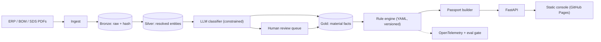

<h1 align="center">Cirquento</h1>
<p align="center"><b>Circularity intelligence &amp; Digital Product Passports for manufacturing supply chains.</b><br/>
Turn raw ERP/BOM/supplier exports into audit-ready product passports where <i>every number is traceable to a source row</i>.</p>

<p align="center">


</p>

> **Live console:** https://darren-2000.github.io/cirquento/ &nbsp;·&nbsp; **Rules:** `rules/circularity.v3.yaml` &nbsp;·&nbsp; **API:** `/api/docs`

---

## 1. Why this exists

Carbon platforms (carbmee EIS™, Sphera, Cozero) answer **"how many kg CO₂e?"**.
From 2027 the ESPR / Digital Product Passport regime asks a *different* question that the same ERP data must answer:

> *What is this product made of, how much of it is recycled, can it be taken apart, which substances of concern are inside, and where does it go at end of life — with evidence?*

That is a **data-engineering problem, not a spreadsheet problem**: messy BOMs, duplicate supplier masters, PDF safety data sheets, free-text material descriptions, and an auditor who will ask *"where did this number come from?"*

Cirquento is the layer that answers it, and it is deliberately **complementary, not competitive**: it consumes the same ERP extracts, exports its material and recycled-content facts back over an open contract, and never recomputes anyone's carbon number.

```
ERP / PLM / procurement ─┬─► carbon platform (carbmee, Sphera)  ─► kg CO₂e
                        └─► Cirquento                        ─► DPP + circularity + evidence
```

**The rule that shapes the whole architecture:** *the LLM may propose, only rules may decide.* Every regulated number is produced by deterministic code; the model only maps messy free text onto a controlled vocabulary, and is allowed to say "I don't know".

## 2. Run it in 30 seconds

No API key, no network, no database server, **no third-party packages**. The offline
backend is a real backend, not a test mock, so this is the same code path production runs.

```bash
git clone https://github.com/DARREN-2000/cirquento && cd cirquento
make verify        # seed → run → replay → tests → eval gate, all offline
```

What `make verify` prints (this is a real transcript, not an illustration):

```
run hash        5b9c9b2012ffb47a…  ruleset circularity.v3
bom lines       812 (812 distinct row keys)
classification  deterministic=627 model=4 cache=181 review=135 abstained=135
suppliers       3 merged, 0 to review
  BR-2210-A    score  83   Held back by recycled_content
  CM-4470-B    score  38   Held back by substances
  CM-4470-C    score  45   Held back by substances
  HS-9001-D    score  34   Held back by substances

replay determinism: IDENTICAL
7 passed, 0 failed
EVAL GATE PASSED
```

## 3. What the demo is actually arguing

The seeded dataset is not decoration — it encodes the product's thesis.

`CM-4470-B` is an EV charge module with an **epoxy-potted power stage**. It scores **38/100**.
Its recyclability is fine (77/100) and its recycled content is respectable (44/100), but
**disassembly scores 5/100**, because disassembly is a *minimum over joints*, not an average.
One non-reversible joint makes the assembly non-separable, and averaging would hide exactly
the defect the regulation exists to surface.

`CM-4470-C` is the same module with a clip-retained housing. It scores **45/100**.
That +7 is not a suggestion from a language model — it is the same deterministic engine
re-run on a modified input, so the improvement promised is the number that would actually
be reported if the change shipped.

## 4. Capabilities

| Capability | How it is done | Status |
| --- | --- | --- |
| **Ingest** ERP/CSV exports | content-hashed bronze rows, `ON CONFLICT DO NOTHING` | ✅ working |
| **Idempotent replay** | `sha256(source_uri, row)` row keys | ✅ verified: reload inserts 0 rows |
| **Entity resolution** | identifier-first → blocking → fuzzy → review band | ✅ 3 merges on the demo set |
| **Material classification** | LLM constrained to a closed taxonomy, with abstention | ✅ offline + OpenAI/Anthropic backends |
| **Circularity scoring** | deterministic versioned rule engine | ✅ 7 tests, range invariant enforced |
| **Passport generation** | canonical JSON-LD + content hash | ✅ byte-identical across replays |
| **Explanations** | every field carries `evidence[]` pointing at source rows | ✅ 280 refs on the demo product |
| **Eval gate in CI** | fails on F1 drop *or* abstention collapse | ✅ wired into GitHub Actions |
| **Messy-file ingest** | exact-alias header mapping, per-column number locale, per-row rejects | ✅ 8/12 rows accepted on `examples/messy_bom.csv`, 4 rejected with reasons |
| **Improvement recommendations** | counterfactuals re-scored by the engine, ranked by real delta | ✅ `+21` bundle vs `+4` single fix on CM-4470-B |
| **PDF passports** | stdlib PDF writer, no third-party dependency | ✅ 5,674-byte valid PDF, 8 objects |
| **Sealed passports (HMAC)** | detached HMAC-SHA256 over the content hash | ✅ verifies; tampering flips it to `False` |
| **Carbon-platform export** | `cirquento.material-facts.v1` contract | ✅ 4 products; *refuses* to emit a CO₂e field |
| **Human review queue** | append-only JSONL, dedup by description, labels back to the golden set | ✅ 135 abstentions → 3 distinct questions |
| Signed passports (X.509 / Ed25519) | HMAC shipped; asymmetric signing not built | 🔜 roadmap |
| Supplier portal | — | 🔜 roadmap |
| Next.js console | static console shipped; SPA not built | 🔜 roadmap |

## 5. Architecture



```
src/cirquento/
  api/          FastAPI routers: passports, suppliers, runs, review
  pipeline/     bronze → silver → gold DAG, idempotent + replayable
  resolve/      entity resolution (identifier, blocking, fuzzy, review band)
  classify/     constrained classification, abstention, cache, offline backend
  rules/        deterministic scoring engine + versioned rule-set loader
  passport/     canonical JSON-LD builder + content hashing
  evidence/     provenance graph: field → source row
  demo/         the seeded dataset that encodes the argument above
rules/          *.yaml — the versioned regulatory logic
evals/          golden set + eval gate (CI blocks on regression)
scripts/        export_console_data.py — generates the console's numbers
docs/           GitHub Pages site (the live console)
```

## 6. Three decisions worth interviewing me about

**a) Constrained generation, with abstention as a first-class outcome.**
The classifier returns `{code, confidence, evidence_span, abstained}` validated against an
enum of the closed taxonomy. Off-taxonomy answers cannot be represented. Below a confidence
floor of `0.72` the row goes to human review rather than into a passport. The eval gate
treats a *falling* abstention rate as a failure: a model that stops admitting uncertainty
looks more accurate while being strictly more dangerous.

Evidence spans are validated as **verbatim substrings of the input**. A fabricated span is a
hard CI failure at any rate above zero, because a passport that cannot quote its own source
defeats the entire product.

**b) Idempotency by content hash.**
Bronze rows are keyed by `sha256(source_uri, canonical_row)` with `sort_keys=True` — without
that, a column reorder in an ERP export would rewrite every key and silently duplicate the
dataset. Verified: the first load inserts 812 rows, an identical reload inserts **0**.

**c) Unknown data never flatters a score.**
Missing recycled content counts as **0%**, never the average — otherwise a supplier improves
a product's score by refusing to send data, inverting the incentive the regulation creates.
The same principle caught a real bug during development: an empty BOM scored 15/100 because
the substances dimension returned a perfect 100 when there was nothing to inspect. Absence of
evidence is not evidence of absence, and there is now a test for it.

## 7. Engineering notes

**The console cannot lie.** Its figures come from `docs/data.js`, generated by
`scripts/export_console_data.py` from an executed pipeline run. Hand-written demo numbers are
how a scoring bug survives review — during development the page said `68` while the engine
actually returned `1522`, caused by a unit mismatch between a 0–100 rule file and a
`* 100` in the engine. The range invariant in `RuleEngine.score` now raises instead of
publishing a nonsense number, and the page is regenerated rather than edited.

**Optional dependencies degrade, they don't fail.** DuckDB falls back to SQLite, RapidFuzz to
`difflib`, OpenTelemetry to a no-op tracer, pytest to `tests/run_all.py`. The thresholds and
semantics are identical either way, so "does it run?" never depends on a successful
`pip install`.

## 8. Measured performance

Measured on this sandbox (Python 3.13, single core, SQLite fallback, offline classifier).
They are small because the workload is small — they are reported as measured, not projected.

| Metric | Measured |
| --- | --- |
| Full pipeline, 812 BOM lines, 4 passports | **~30 ms** |
| Distinct descriptions actually classified | 15 of 812 lines (rest hit cache/rules) |
| Classification routing | 627 deterministic · 181 cached · 4 model |
| Replay of the same input | byte-identical passport hashes |
| Idempotent reload | 812 rows → 0 inserted |
| Test suite | 30 passed, 0 failed, no third-party deps |
| Passport PDF | 5,674 bytes, 8 PDF objects, valid `%PDF`/`xref`/`%%EOF` |
| Seal verification | `VALID`; score edited 38 → 95 ⇒ `False` |
| Messy CSV ingest | 8/12 rows accepted, 4 rejected with row numbers |
| Review queue | 135 abstained lines → 3 distinct questions |

**Eval gate**, 36 labelled lines: F1 `1.000`, abstention `0.111`, off-taxonomy `0.000`,
fabricated evidence `0.000`. The perfect F1 is a statement about the *deterministic offline
backend* on a small golden set — it is not a claim about live LLM accuracy. The golden set is
sized to make the gate meaningful in CI, not to benchmark a model.

The honest way to grow it is not to invent rows: `cirquento review export-labels` turns
human-resolved queue items into golden-set lines, including `null` for descriptions a human
judged unclassifiable. Review effort compounds into the eval instead of evaporating.

### What the numbers deliberately do not say

- **HMAC sealing is not third-party-verifiable signing.** It is symmetric: anyone who can
  verify a seal can also forge one. It proves a passport was not altered *in transit between
  parties who share the key*. Third-party verification needs Ed25519/X.509, which is on the
  roadmap and is not pretended to exist.
- **Recommendation deltas marked `conditional` are not earned.** They model what happens if a
  supplier produces evidence, at that supplier's own evidenced rate. If a supplier has
  evidenced nothing, no upside is claimed at all.
- **The recommender never invents an action.** Each delta is the score the same rule engine
  returns after applying the change to the real BOM.

## 9. Roadmap

- [x] Bronze/silver/gold pipeline, idempotent replays
- [x] Constrained classification + abstention + review queue
- [x] Rule engine, circularity scoring, evidence graph
- [x] Canonical JSON-LD passports + content hashing
- [x] Data-driven console published to GitHub Pages
- [x] PDF passport rendering (stdlib, no dependency)
- [x] Detached HMAC-SHA256 passport seals + tamper detection
- [x] Messy ERP/CSV ingest with a schema contract and per-row rejections
- [x] Engine-computed improvement recommendations
- [x] Carbon-platform export contract (material facts, no emissions figure)
- [x] Human review queue that feeds the golden set
- [ ] Asymmetric passport signing (Ed25519 / X.509) for third-party verification
- [ ] Battery-passport profile (Feb 2027 regime)
- [ ] Supplier portal for primary-data requests
- [ ] Pull PCFs back from the carbon platform (push side is built)

## 10. License

Apache-2.0 — see [`LICENSE`](LICENSE).
